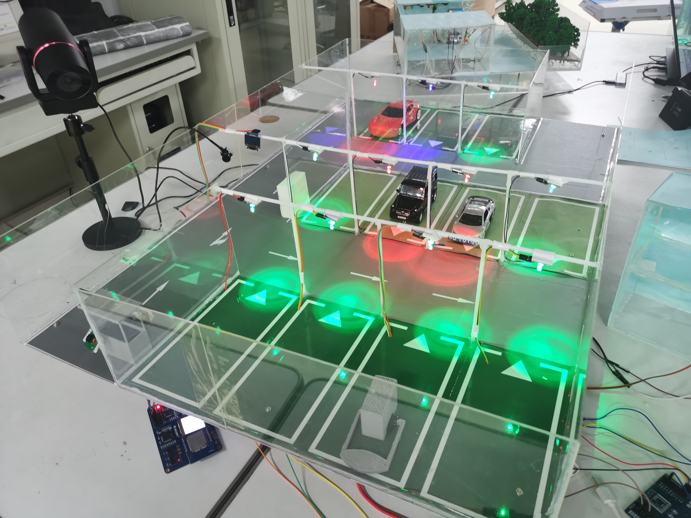

# Smart-Shared-Parking-System-Based-on-Huawei-Cloud
### Competition works
The work includes software and hardware parts, and currently only the modeling part done at that time and the implementation plan for QR code recognition in the password cabinet have been uploaded;\
Due to technical issues with some documents, they will be compiled and continuously updated in the future!
## 项目沙盘模型

